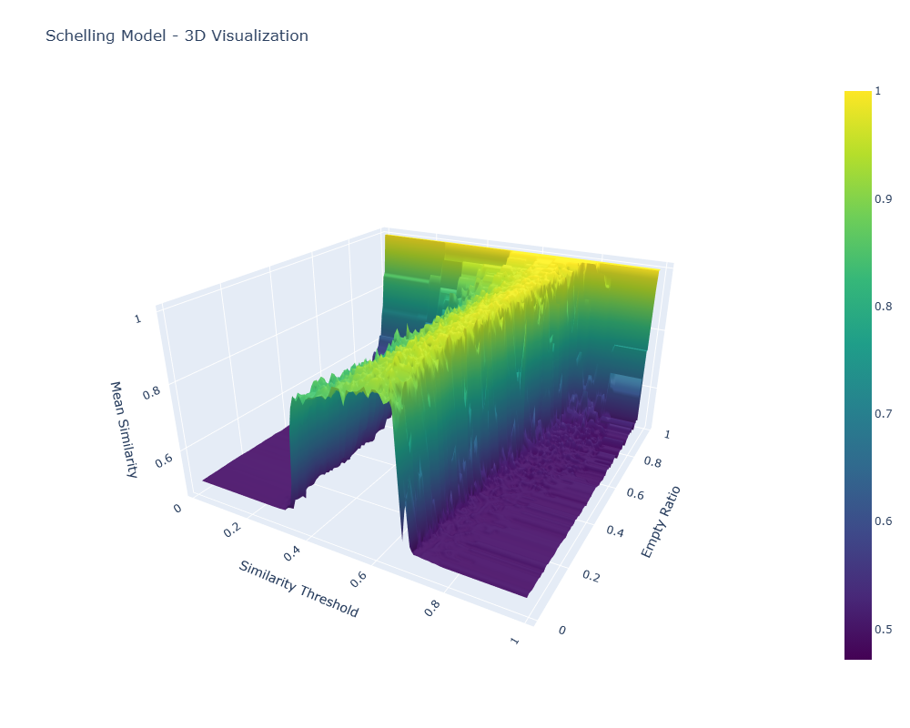
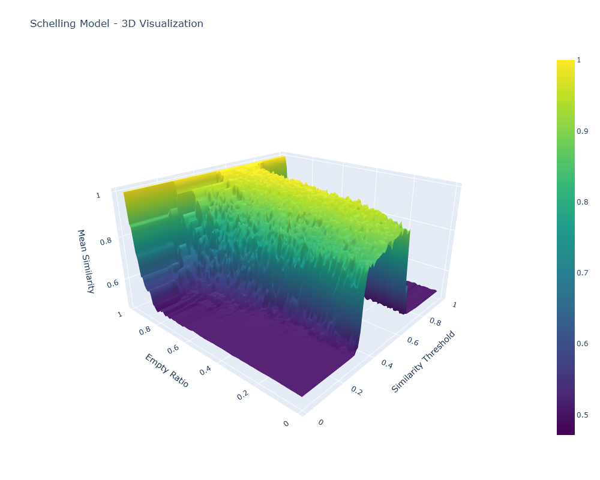
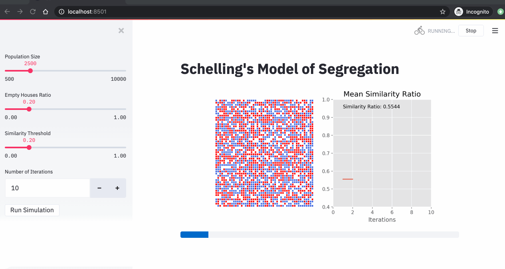

# Schelling Segregation Model Visualization

## Overview

This project implements and visualizes Thomas Schelling's segregation model (1971), a classic agent-based model demonstrating how individual preferences can lead to emergent segregation patterns, even when individuals don't have strong segregationist preferences, visualizing the final state as a two-dimensional manifold in three dimensions.

## What is the Schelling Model?

Thomas Schelling, an economist and Nobel laureate, created this model to explain how spatial segregation can emerge from individual choices. The model shows that even mild preferences for similar neighbors can lead to highly segregated communities - a powerful illustration of how micro-motives can produce macro-behaviors.

In the model:
- Agents (representing individuals) live on a grid
- Each agent belongs to one of two groups (represented by -1 and 1)
- Some cells remain empty (represented by 0)
- Agents prefer a certain percentage of their neighbors to be similar to them (the "similarity threshold")
- Unsatisfied agents move to random empty locations

## Visualizations Explained
<p float="left">
  
   
</p>

The visualizations show how two key parameters affect the final state of the system after 15 iterations:

1. **Empty Ratio (y-axis)**: The proportion of cells that are empty (0-1)
2. **Similarity Threshold (x-axis)**: The minimum proportion of similar neighbors an agent requires to be satisfied (0-1)
3. **Mean Similarity (z-axis/color)**: The resulting average similarity ratio across all agents


### Key Insights from the Visualization

- When similarity thresholds are low, agents are easily satisfied and the mean similarity stays close to 0.5 (random distribution)
- As similarity thresholds increase, a phase transition occurs where segregation patterns emerge rapidly
- Very high empty ratios make it easier for agents to find satisfactory positions, potentially reducing extreme segregation

## Code Structure

- `schelling_modal.py`: Implements the Schelling model and runs simulations using Modal for distributed computing
- `visualize_results.py`: Creates interactive 3D surface and 2D heatmap visualizations from simulation results
- `schelling_results.json`: Contains simulation results for all parameter combinations

## How to Run

### Requirements
- Python 3.12+
- Modal (`pip install modal`)
- Plotly (`pip install plotly`)
- Pandas (`pip install pandas`)
- NumPy (`pip install numpy`)

### Running the Simulation
```bash
# Run the simulation (requires Modal setup)
modal run schelling_modal.py

# Generate visualizations from results
python visualize_results.py
```

### Viewing Results
Open `schelling_visualization.html` or `schelling_3d_plot.html` in any modern web browser to explore the interactive visualizations.

## Parameters

- Grid size: 50×50 (2500 cells)
- Number of neighbors considered: 3 in each direction
- Iterations: 15
- Empty ratio range: 0.01-0.99 (step: 0.01)
- Similarity threshold range: 0.01-0.99 (step: 0.01)

## References

- Schelling, T. C. (1971). "Dynamic Models of Segregation." Journal of Mathematical Sociology, 1, 143-186.
- “An Implementation of Schelling Segregation Model Using Python and Streamlit // Adil Moujahid // Bridging Tech and Art.” https://adilmoujahid.com/posts/2020/05/streamlit-python-schelling/.
